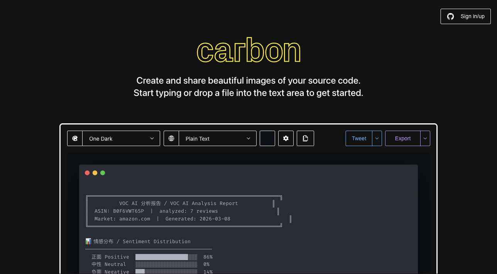

<p align="center">
  
</p>

<h1 align="center">VOC Amazon Reviews</h1>

<p align="center">
  <strong>AI-powered Amazon review analysis that turns customer voices into actionable product intelligence.</strong>
</p>

<p align="center">
  <a href="#quick-start"></a>
  <a href="https://openclaw.ai"></a>
  <a href="https://claude.ai/code"></a>
  <a href="LICENSE"></a>
  
  
</p>

<p align="center">
  <a href="#install">Install</a> &bull;
  <a href="#usage">Usage</a> &bull;
  <a href="#sample-output">Sample Output</a> &bull;
  <a href="#how-it-works">How It Works</a> &bull;
  <a href="docs/ROADMAP.md">Roadmap</a>
</p>

---

**Input an ASIN. Get deep bilingual insights.** Scrapes real Amazon reviews with browser automation (bypassing anti-bot), then runs them through AI for semantic VOC analysis. No keyword counting — actual language understanding.

<p align="center">
  
</p>

## Features

| Feature | Description |
|---------|-------------|
| **Sentiment Analysis** | Positive / neutral / negative breakdown with percentages |
| **Pain Points** | Top 5 customer complaints with real quotes and mention counts |
| **Selling Points** | Top 5 things buyers love with real quotes and mention counts |
| **Listing Optimization** | Actionable copy suggestions backed by review data |
| **Bilingual Output** | Every insight in both English and Chinese |
| **Multi-Market** | Supports 6 Amazon regions (US, UK, DE, JP, CA, FR) |
| **Anti-Bot Bypass** | Browserbase stealth mode + residential proxy |
| **Natural Language** | Just tell Claude "analyze reviews for ASIN B08N5..." |

## Quick Start

```bash
# One-line install (Claude Code)
mkdir -p .claude/skills && cd .claude/skills && git clone https://github.com/mguozhen/voc-amazon-reviews.git

# Or via OpenClaw
clawhub install voc-amazon-reviews
```

Then just ask Claude:

> "Analyze the reviews for ASIN B08N5WRWNW"

That's it. No config files. No API keys to juggle.

## Install

### Claude Code
```bash
mkdir -p .claude/skills
cd .claude/skills
git clone https://github.com/mguozhen/voc-amazon-reviews.git voc-amazon-reviews
```

### OpenClaw
```bash
clawhub install voc-amazon-reviews
```

## Setup

<details>
<summary><strong>1. Browser skill (required)</strong></summary>

```bash
npx skills add browserbase/skills@browser
```
</details>

<details>
<summary><strong>2. Browserbase account (recommended)</strong></summary>

Handles Amazon's anti-bot, CAPTCHAs, and residential proxies. [Sign up free](https://browserbase.com).

```bash
export BROWSERBASE_API_KEY="your-key"
export BROWSERBASE_PROJECT_ID="your-project-id"
browse env remote
```

Without Browserbase, the scraper falls back to local Chrome but may be blocked by Amazon's sign-in wall.
</details>

<details>
<summary><strong>3. OpenClaw model (auto-configured)</strong></summary>

The skill uses whatever model is currently configured in OpenClaw. No separate API key needed.

```bash
openclaw models status    # Check current model
openclaw models set       # Switch model
```
</details>

## Usage

### Natural language (just talk to Claude)

```
"Analyze the reviews for ASIN B08N5WRWNW"
"Do a VOC analysis on this product: B0F6VWT6SP"
"What are customers complaining about for B09G9HD6PD?"
"Find the top selling points from Amazon reviews for B08XYZ"
```

### CLI

```bash
# Basic analysis (100 reviews)
bash skills/voc-amazon-reviews/voc.sh B08N5WRWNW

# Deep analysis (200 reviews)
bash skills/voc-amazon-reviews/voc.sh B08N5WRWNW --limit 200

# UK marketplace
bash skills/voc-amazon-reviews/voc.sh B08N5WRWNW --market amazon.co.uk

# Save report
bash skills/voc-amazon-reviews/voc.sh B08N5WRWNW --output report.md
```

### Options

| Flag | Default | Description |
|------|---------|-------------|
| `--limit N` | 100 | Number of reviews to scrape |
| `--market DOMAIN` | amazon.com | Amazon region (`.co.uk`, `.de`, `.co.jp`, `.ca`, `.fr`) |
| `--output FILE` | stdout | Save report to markdown file |
| `--help` | — | Show help |

## Sample Output

```
╔══════════════════════════════════════════════════════════════╗
║                  VOC AI Analysis Report                     ║
║  ASIN: B08N5WRWNW  |  Reviews analyzed: 100                ║
║  Market: amazon.com  |  Generated: 2026-03-08              ║
╚══════════════════════════════════════════════════════════════╝

📊 Sentiment Distribution
  Positive  ████████████████░░░░  74%
  Neutral   ███░░░░░░░░░░░░░░░░░  16%
  Negative  ██░░░░░░░░░░░░░░░░░░  10%

🔴 Top 5 Pain Points
══════════════════════════════════════════════════════════════
1. Short battery life (28 mentions)
   "Battery drained in 2 days, very disappointed"

2. Unstable Bluetooth connection (19 mentions)
   "Keeps disconnecting randomly, have to re-pair every day"
   ...

🟢 Top 5 Selling Points
══════════════════════════════════════════════════════════════
1. Excellent sound quality (52 mentions)
   "Amazing bass and crystal clear highs for the price"
   ...

💡 Listing Optimization Suggestions
══════════════════════════════════════════════════════════════
1. Add battery capacity (e.g. 800mAh) and playtime to title
   → reduces 1-star reviews from mismatched expectations

2. Lead with sound quality in first bullet —
   → use customer language: "crystal clear" and "deep bass"
   ...
```

## How It Works

```
┌─────────────┐     ┌──────────────────┐     ┌─────────────────┐
│  Input ASIN │────▶│  Browser Scraper  │────▶│  AI Analysis    │
│             │     │  (Browserbase)    │     │  (OpenClaw)     │
└─────────────┘     │                  │     │                 │
                    │  • Stealth mode  │     │  • Sentiment    │
                    │  • Anti-bot      │     │  • Pain points  │
                    │  • Pagination    │     │  • Sell points   │
                    │  • Multi-market  │     │  • Optimization │
                    └──────────────────┘     └────────┬────────┘
                                                      │
                                                      ▼
                                            ┌─────────────────┐
                                            │ Bilingual Report │
                                            │   (EN + ZH)     │
                                            └─────────────────┘
```

## File Structure

```
voc-amazon-reviews/
├── SKILL.md       # Skill definition (Claude/OpenClaw reads this)
├── voc.sh         # Main entry point
├── scraper.sh     # Amazon review scraper (uses browse CLI)
├── analyze.sh     # AI analysis + report renderer
└── docs/
    ├── GTM.md           # Go-to-market strategy
    ├── ROADMAP.md       # Product roadmap
    ├── STORY.md         # Project narrative
    └── screenshots/     # Report screenshots
```

## FAQ

<details>
<summary><strong>Why not use the Amazon Product Advertising API?</strong></summary>

Amazon's API doesn't expose review text — only aggregate star ratings. Seller Central exports are manual and incomplete. Real browser scraping is the only way to get the actual voice of your customers.
</details>

<details>
<summary><strong>How much does it cost?</strong></summary>

| Component | Cost |
|-----------|------|
| Browserbase session | ~$0.01/run |
| AI model analysis | Depends on your OpenClaw model |

Running on local Chrome (no Browserbase) is free but may be blocked by Amazon. Total cost per analysis is typically under $0.05.
</details>

<details>
<summary><strong>Is this against Amazon's Terms of Service?</strong></summary>

This tool accesses publicly visible review pages the same way a browser does. Use responsibly — avoid high-frequency scraping of the same ASIN.
</details>

<details>
<summary><strong>What about API keys and security?</strong></summary>

`BROWSERBASE_API_KEY` is read from environment variables — never written to disk or printed to stdout. Analysis runs through OpenClaw's configured model, so no separate LLM API key is needed. Use shell-level `export`, not inline assignments, as AI agent session logs may capture tool call arguments.
</details>

## Related

- [VOC AI](https://www.voc.ai) — Full-featured Amazon review analytics platform (2B+ reviews indexed)
- [Social Reply Bot](https://github.com/mguozhen/social-bot) — AI-powered Reddit & X auto-reply bot
- [Solvea](https://solvea.cx) — AI receptionist for small businesses

## License

MIT
